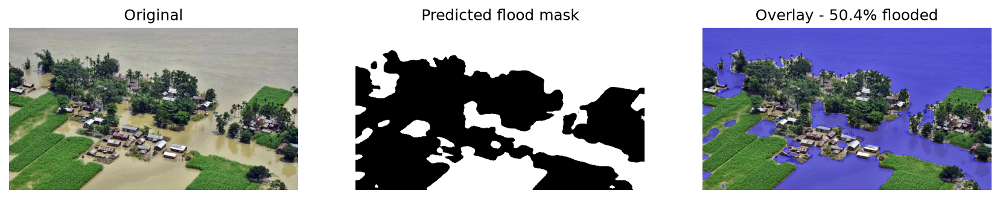
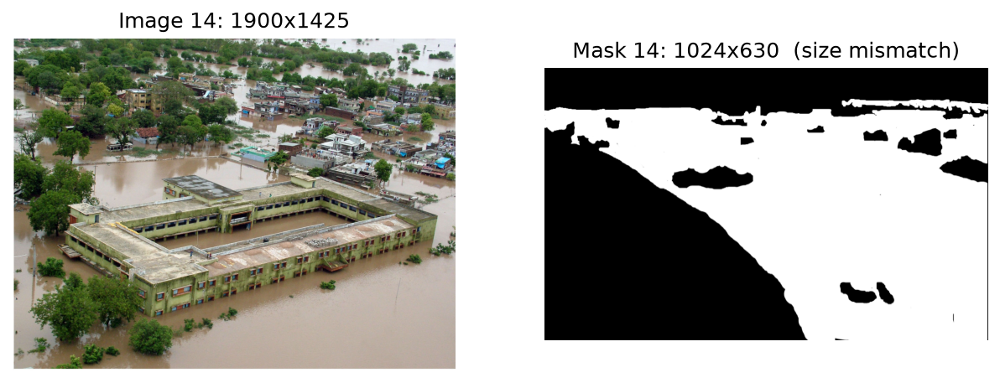
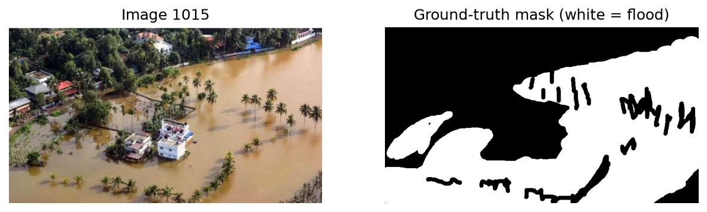
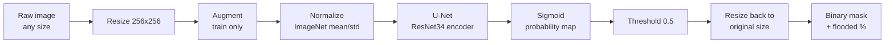
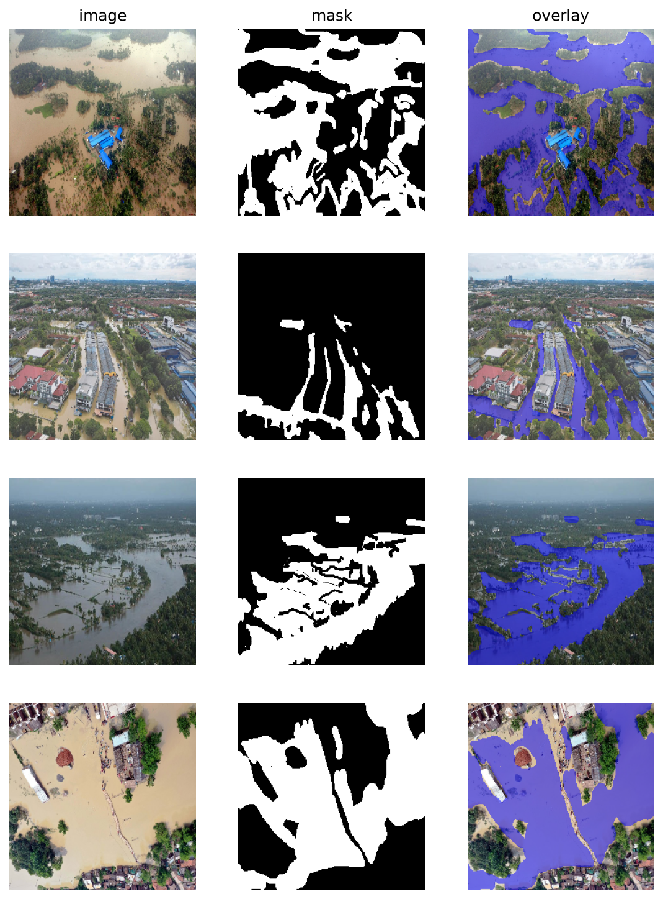
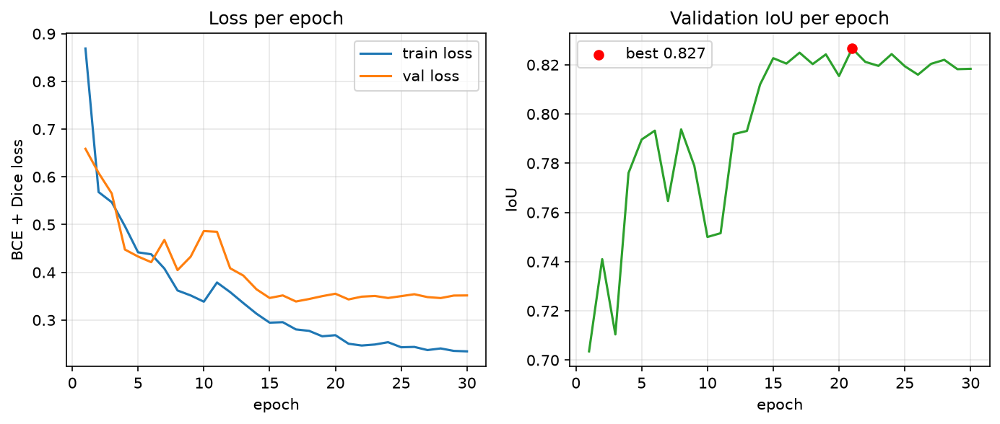
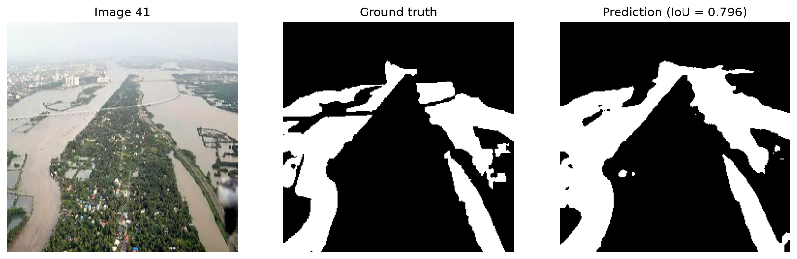

# Flood Disaster Relief System: Flood Area Segmentation with U-Net

> Computer Vision final project. A deep-learning system that looks at an aerial, drone or satellite photo, **marks every flooded pixel**, and reports the **estimated flooded percentage** of the scene.

| | |
|---|---|
| **Task** | Binary semantic segmentation (flood / not flood) |
| **Model** | U-Net with an ImageNet-pretrained **ResNet34** encoder (~24 M parameters) |
| **Data** | Kaggle *Flood Area Segmentation*, 283 usable image/mask pairs |
| **Best validation IoU / Dice** | **0.827 / 0.905** (epoch 21 of 30) |
| **GitHub repo** | https://github.com/UtsavChand/flood-disaster-response-cv |
| **Live hosting link** | TBD |
| **Report** | This document (Background, Methodology, Results, Visuals below) |

<p align="center">
<<<<<<< Updated upstream
  <br>
=======
  <br>
>>>>>>> Stashed changes
  <em>Model output on an unseen drone image: original, predicted mask, blue overlay and the flooded percentage.</em>
</p>

---

## Table of contents

1. [Background](#1-background)
2. [Dataset](#2-dataset)
3. [Methodology](#3-methodology)
4. [Results](#4-results)
5. [Why these design choices](#5-why-these-design-choices)
6. [Limitations and future work](#6-limitations-and-future-work)
7. [Repository structure](#7-repository-structure)
8. [How to run](#8-how-to-run)

---

## 1. Background

### The problem
Floods are among the most frequent and damaging natural disasters. In the first hours after a flood, relief teams need to know **where the water is, how much of an area it covers, and which places are cut off**. Today that is mostly done by people looking at drone footage or satellite images by hand, which is slow, subjective and does not scale when thousands of images arrive at once.

### What this project does
We automate the first step: given a single aerial image, the system outputs

1. a **pixel-level flood mask** (which pixels are water), and
2. a **flooded-area percentage** = flooded pixels / total pixels.

That number can be used to rank affected areas and decide where to send help first.

### Why segmentation (and not classification or detection)?

| Approach | Output | Why it is not enough |
|---|---|---|
| Image classification | "flooded" / "not flooded" for the whole image | Cannot say *how much* or *where* |
| Object detection | Bounding boxes | Floodwater has no fixed shape; boxes do not fit it |
| **Semantic segmentation** | **A label for every pixel** | Gives exact extent, so the percentage comes for free |

### Objective
Train a segmentation network that reaches strong overlap with human-drawn flood masks (measured by **IoU** and **Dice**) on images it has never seen, while staying small enough to run on a single GPU, or even a CPU, at inference time.

---

## 2. Dataset

**Source:** Kaggle *Flood Area Segmentation* (aerial / drone / satellite flood photos with hand-drawn binary masks). The images are **not** stored in this repo (see [Get the data](#get-the-data)).

| Property | Value |
|---|---|
| Raw image/mask pairs | 290 |
| Pairs removed (size mismatch) | 7 (stems 14, 15, 2052, 2053, 1061, 1079, 3059) |
| **Usable pairs** | **283** |
| Image sizes | Highly variable, from about 500x300 to over 2000x1400 px |
| Mask format | Single-channel grayscale PNG (255 = flood) |

### Data-quality problems we found and fixed

1. **Image/mask size mismatches.** For 7 stems the mask has a different resolution from its image. Some are swapped pairs (14 and 15, 2052 and 2053: image 14 matches mask 15 and vice versa). Training on these would silently teach the network wrong labels, so they were removed.

<<<<<<< Updated upstream
   <p align="center"></p>
=======
   <p align="center"></p>
>>>>>>> Stashed changes

2. **Masks are not truly binary.** The masks were saved with anti-aliasing, so besides 0 and 255 they contain intermediate grays. In the first mask we inspected, 114,928 pixels were 255, 361,968 were 0, and **15,147 pixels (about 3.1%) were in between**. We binarise with `mask > 127`.

3. **Variable image sizes and aspect ratios.** Handled by resizing (see below).

### Fixed train / validation / test split

| Split | Images | Share |
|---|---|---|
| Train | 198 | 70% |
| Validation | 42 | 15% |
| Test | 43 | 15% |

The split was made once with `train_test_split(random_state=42)` and stored in **`data/split.csv`**, which is committed to Git so every experiment and every team member uses the identical split. **The test set is only used for final evaluation, never for tuning.**

<p align="center"><br><em>A raw image and its ground-truth mask.</em></p>

---

## 3. Methodology

### 3.1 Pipeline overview



### 3.2 Preprocessing

| Step | Detail | Reason |
|---|---|---|
| Resize | every image and mask to **256 x 256** | Networks need a fixed input size; 256 keeps training fast and fits in memory. Input size must be divisible by 32 for a ResNet encoder, and 256 is |
| Mask binarisation | `mask > 127` becomes {0, 1} | Removes anti-aliasing noise |
| Normalisation | ImageNet mean `(0.485, 0.456, 0.406)`, std `(0.229, 0.224, 0.225)` | The encoder was pretrained with these statistics, so inputs must match |
| Sanity check | `FloodDataset` raises an error if an image and its mask differ in size | Stops a mismatched pair from ever reaching training |

### 3.3 Data augmentation (training set only)

With only 198 training images, overfitting is the main risk. Augmentations are applied **identically to image and mask** (Albumentations):

| Augmentation | Probability | Why it is safe for flood imagery |
|---|---|---|
| Horizontal flip | 0.5 | Floods have no left/right orientation |
| Vertical flip | 0.2 | Aerial and satellite views have no fixed "up" |
| Random brightness / contrast | 0.3 | Simulates different weather, time of day, cameras |

Validation and test images get **resize + normalise only**, so the metrics are not affected by random changes.

<p align="center"><br><em>Augmented training samples: image, mask and overlay. Note the vertically flipped last row.</em></p>

### 3.4 Model architecture: U-Net with a ResNet34 encoder

**U-Net** is an encoder-decoder network built for segmentation:

- **Encoder (ResNet34, ImageNet-pretrained).** Progressively shrinks the image (256 -> 128 -> 64 -> 32 -> 16 -> 8) while increasing the number of feature channels. Early layers see edges and colours; deep layers see textures and "this looks like water" semantics.
- **Decoder.** Progressively upsamples back to 256 x 256, rebuilding the spatial detail needed for a pixel-accurate mask.
- **Skip connections.** Feature maps from each encoder stage are concatenated into the matching decoder stage. The decoder gets *what* (deep features) plus *where* (fine detail), which is what gives U-Net sharp boundaries.
- **Head.** A 1-channel convolution outputs one **logit** per pixel; a sigmoid turns it into a flood probability.

```python
# src/model.py
smp.Unet("resnet34", encoder_weights="imagenet", in_channels=3, classes=1)
```

**Transfer learning:** the encoder starts from ImageNet weights rather than random ones. With under 200 training images, training a deep network from scratch would overfit; pretrained features (edges, textures, colours) transfer well to aerial imagery and make training converge in tens of epochs.

A second architecture, **DeepLabV3+ (ResNet34)**, is implemented in `src/model.py` as a comparison model (`--model deeplab`).

### 3.5 Loss function: BCE + Dice

```
loss = BCEWithLogitsLoss(logits, mask) + DiceLoss(logits, mask)
```

| Component | What it does | Why we need it |
|---|---|---|
| Binary cross-entropy | Penalises every pixel independently | Smooth, stable gradients |
| Dice loss | Penalises low *overlap* between prediction and mask | Directly optimises what we are scored on and handles class imbalance (flood pixels can be a small fraction of an image) |

### 3.6 Training setup

| Setting | Value |
|---|---|
| Optimiser | Adam |
| Learning rate | 3e-4, **cosine annealing** to ~0 over the run |
| Batch size | 8 |
| Epochs | 30 |
| Input size | 256 x 256 x 3 |
| Model selection | Checkpoint saved whenever **validation IoU** improves |
| Framework | PyTorch, `segmentation-models-pytorch`, Albumentations |

Cosine annealing starts with large steps to learn quickly, then shrinks the learning rate smoothly so the weights settle into a good minimum instead of bouncing around it.

### 3.7 Evaluation metrics

Computed from pixel counts accumulated over the whole validation set (TP = true positive pixels, FP = false positive, FN = false negative), at 256 x 256 resolution, threshold 0.5:

| Metric | Formula | Meaning |
|---|---|---|
| **IoU** (Jaccard) | TP / (TP + FP + FN) | Overlap between predicted and true flood area. Main metric |
| **Dice** (F1) | 2TP / (2TP + FP + FN) | Similar to IoU but more forgiving. Always >= IoU |
| Precision | TP / (TP + FP) | Of the pixels we called flood, how many really were |
| Recall | TP / (TP + FN) | Of the real flood pixels, how many we found |

For a relief system, **recall matters a lot**: missing flooded land is worse than slightly over-marking it.

### 3.8 Inference

`src/predict.py` implements the deployed behaviour:

1. Resize to 256 x 256 and normalise (no augmentation).
2. Forward pass, then sigmoid to get a probability map.
3. **Bilinearly resize the probability map back to the original image size.** Upsampling probabilities (not the binary mask) gives smoother edges.
4. Threshold at 0.5 to get the binary mask.
5. `flooded % = mask.mean() * 100`.

---

## 4. Results

### 4.1 Validation performance (best checkpoint, epoch 21)

| Model | Val IoU | Val Dice | Val Precision | Val Recall | Val loss |
|---|---|---|---|---|---|
| **U-Net (ResNet34)** | **0.827** | **0.905** | 0.895 | 0.915 | 0.343 |

### 4.2 Training curves

<p align="center"></p>

| Observation | Evidence |
|---|---|
| Fast early learning | Val IoU rises from 0.704 (epoch 1) to 0.823 by epoch 15 |
| Plateau after epoch ~15 | Val IoU stays between 0.815 and 0.827; mean of last 10 epochs is 0.821 (std 0.003) |
| Cosine schedule stabilises training | Early epochs (7 to 11) are noisy at high learning rate; later epochs are smooth |
| Mild overfitting | Final train loss 0.234 vs val loss 0.352. The gap is expected with only 198 training images |
| Recall > precision | 0.915 vs 0.895 at the best epoch: the model slightly over-marks water rather than missing it, the safer error for disaster response |

The best checkpoint (epoch 21) is slightly better than the final epoch (0.827 vs 0.818); selecting by validation IoU avoids using a slightly overfit last epoch.

### 4.3 Sample outputs

<<<<<<< Updated upstream
**Prediction on an unseen image.** Flooded area estimated at 27.0%:

<p align="center"></p>

**Ground truth vs prediction on a test-split image** (IoU = 0.832, close to the overall validation IoU):
=======
**Prediction on an unseen image.** The flooded percentage is shown in the figure title:

<p align="center"></p>

**Ground truth vs prediction on a test-split image** (the per-image IoU is shown in the figure title):
>>>>>>> Stashed changes

<p align="center"></p>

### 4.4 Test-set and model-comparison results

| Model | Test IoU | Test Dice |
|---|---|---|
<<<<<<< Updated upstream
| U-Net (ResNet34) | TBD | TBD |
| DeepLabV3+ (ResNet34) | TBD | TBD |

=======
| U-Net (ResNet34) | **0.792** | **0.884** |
| DeepLabV3+ (ResNet34) | TBD | TBD |

On the 43 test images the U-Net also reaches precision 0.868 and recall 0.900. Test IoU (0.792) is a little lower than validation IoU (0.827), which is expected: the checkpoint was selected on the validation set, while the test set was never used for any decision. Recall is again higher than precision, so the model still errs on the side of over-marking water.

>>>>>>> Stashed changes
> Validation numbers above were used to choose the checkpoint. The held-out **test split (43 images)** is evaluated once, at the end, to give an unbiased estimate.

---

## 5. Why these design choices

| Choice | Alternatives | Why this one |
|---|---|---|
| **U-Net** | FCN, DeepLabV3+, SegFormer | Skip connections give sharp boundaries and U-Net is known to work well on small datasets |
| **ResNet34 encoder** | ResNet18/50, EfficientNet | Good accuracy/size balance (~24 M params total); deeper ResNet50 would overfit more on 198 images and train slower |
| **ImageNet pretraining** | Random init | Tiny dataset; pretrained features speed up convergence and improve generalisation |
| **256 x 256 input** | 512 x 512, original size | Divisible by 32, 4x cheaper than 512, fits in memory with batch size 8. Some thin detail is lost |
| **BCE + Dice** | BCE only | Dice optimises overlap directly and counters class imbalance |
| **IoU for model selection** | Loss, accuracy | Pixel accuracy is misleading when classes are imbalanced; IoU is the standard segmentation metric |
| **Adam + cosine annealing** | SGD, constant LR | Fast convergence with a smooth settling phase |
| **Flips and brightness only** | Heavy geometric or colour warps | Cheap, label-preserving, physically realistic for aerial imagery |
| **Fixed committed split** | Random split every run | Makes every run directly comparable |

---

## 6. Limitations and future work

| Limitation | Possible improvement |
|---|---|
| Very small dataset (198 training images) | More data, stronger augmentation, or cross-validation |
| Resizing to a square 256 x 256 distorts aspect ratio and loses fine detail | Train at higher resolution or use aspect-preserving padding / tiling |
| Muddy water vs wet soil and reflections can confuse a colour-driven model | Add more varied scenes; test-time augmentation |
| Masks are annotated by hand and noisy at the edges | Cleaner labels; boundary-aware loss |
| Metrics are computed at 256 x 256, not at each image's original resolution | Evaluate at original resolution |
| Single flood dataset | Test on other sources (e.g. satellite / SAR) to measure generalisation |
| Only the U-Net result is reported so far | Finish the DeepLabV3+ comparison and add a stronger encoder or Transformer baseline |

---

## 7. Repository structure

```
data/
  Image/, Mask/        # Kaggle dataset (NOT in Git, download separately)
  split.csv            # fixed train/val/test split (in Git, do not regenerate)
notebooks/
  01_data_exploration.ipynb
  02_data_preprocessing.ipynb
  03_training.ipynb
  04_predict_demo.ipynb
src/
  dataset.py           # FloodDataset + transforms
  model.py             # build_model("unet" | "deeplab")
  train.py             # training loop, loss, metrics
  predict.py           # load_model, predict, predict_proba
checkpoints/           # trained weights (NOT in Git, download separately)
<<<<<<< Updated upstream
=======
make_figures.py        # regenerates every figure in results/
>>>>>>> Stashed changes
results/
  unet_history.csv     # per-epoch metrics
  unet_curves.png      # training curves
  figures/             # figures used in this report
```

---

## 8. How to run

### Setup

```bash
git clone https://github.com/UtsavChand/flood-disaster-response-cv.git
cd flood-disaster-response-cv
python -m venv .venv
.venv\Scripts\activate          # Windows  (Linux/macOS: source .venv/bin/activate)
pip install -r requirements.txt
```

### Get the data

1. Download the Kaggle **"Flood Area Segmentation"** dataset.
2. Put the images in `data/Image/` and the masks in `data/Mask/`.

`data/split.csv` already excludes the 7 mismatched pairs, leaving 283 images. **Do not regenerate `split.csv`**: the split cell in the preprocessing notebook is for reference only.

### Get the trained model

Download `unet_best.pth` (link: TBD) and place it at `checkpoints/unet_best.pth`. No training is needed.

### Predict (run from the project root)

```python
import numpy as np
from PIL import Image
from src.predict import load_model, predict, predict_proba

model = load_model("checkpoints/unet_best.pth", "unet")

img = Image.open("data/Image/1.jpg").convert("RGB")
mask = predict(model, img)            # uint8 array (0/1), same size as the image
prob = predict_proba(model, img)      # float map (0-1), same size as the image

print(f"{mask.mean() * 100:.1f}% flooded")

# overlay: blend blue onto flooded pixels
arr = np.array(img)
overlay = arr.copy()
overlay[mask == 1] = (0.5 * arr[mask == 1] + 0.5 * np.array([0, 0, 255])).astype(np.uint8)
Image.fromarray(overlay).save("overlay.png")
```

Or open `notebooks/04_predict_demo.ipynb` for a ready-made demo.

### Train (only if you want to retrain)

```bash
python -m src.train --model unet --epochs 30
python -m src.train --model deeplab --epochs 30   # comparison model
```

Training overwrites `checkpoints/<model>_best.pth`; curves and logs are saved in `results/`.

<<<<<<< Updated upstream
=======
### Regenerate the report figures

```bash
python make_figures.py
```

>>>>>>> Stashed changes
### Team rules

- Work on branches and merge through pull requests.
- Never commit `data/Image`, `data/Mask`, or `.pth` files.
- Evaluate only on the test split.
